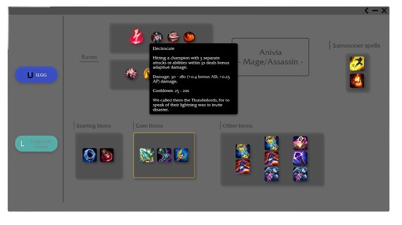

This repository is no longer maintained and will probably not work properly and you may experience crashing of the app

# JLB
This project requires Java Runtime **v18** or higher. Click to [download](https://download.oracle.com/java/18/archive/jdk-18.0.2_windows-x64_bin.exe)
### Application made in JavaFX framework.

This app provides support for League of Legends sites like **U.GG**, **Mobafire** or **League of Graphs**
for easy access to the item builds of champions. You can choose whatever page you want and look up the build
for your champion. 

You can even quickly switch between pages that have statistically created their builds 
(Mobafire is one of the "community created" builds which does not support this feature) and compare those builds
to think what's better for you.

## How to use?
### Main Page
App is very easy to use. What you see underneath is **Main Scene**

Currently, you are able to choose from two websites: [U.GG](https://u.gg/) and [League of Graphs](https://www.leagueofgraphs.com/). This page is only for the first time when you are
choosing your desired page (you cannot go back here).

After choosing your page, you will be redirected to:
### Champions Page
Each LoL page has list of champions for which you can look up the build (change will be only noticeable when Riot adds new champion, because not every page may have the build ready).

Simply, you just choose one of the champions given below. After pressing on one of these, a build page of champion will appear.

Additionally, you can *"change your mind"* even here on the Champions page, where at the top there is a bar with buttons (with the names of the Lol build Websites). 
Currently used page will be automatically changed to the page you clicked and build will be shown from clicked page. You can tell which page you have active thanks to the image
next to the text, chosen page will have **full opacity**.

### Build Page
Finally, the build page, core of this app

You are given the runes for the champion, champion's *most optimal build and his summoner spells which most people use.

You are also able to view a short tooltip for each **Item** and **Rune**.

As mentioned before, you can **switch between pages** that are shown on the left side of this page to compare build between themselves.

## Disclaimer
Since this app provides you with data which are **scraped** from various websites, using word *most optimal* is relative.
Builds for champs are created statistically by the website providers (U.GG, League of Graphs, et.).

It is up to you to consider if the build is optimal or not. Additionally, there are even pages like **Mobafire** where builds are created
directly from players where is even more to consider.
