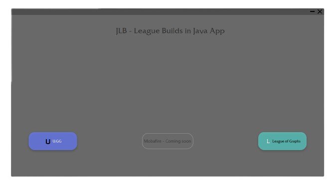
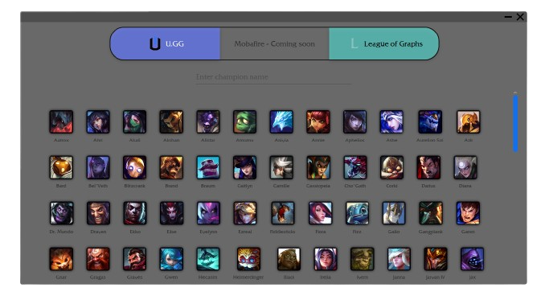

# JLB
### Application made in JavaFX framework.

This app provides support for League of Legends sites like **U.GG**, **Mobafire** or **League of Graphs**
for easy access to the item builds of champions. You can choose whatever page you want and look up the build
for your champion. 

You can even quickly switch between pages that have statistically created their builds 
(Mobafire is one of the "community created" builds which does not support this feature) and compare those builds
to think what's better for you.

## How to use?
### Main Page
App is very easy to use. What you see underneath is **Main Scene**

I don't think this needs to be explained. You just choose the page you want your data from.

You can use: 
- [U.GG](https://u.gg/)
- [Mobafire](https://www.mobafire.com/)
- [League of Graphs](https://www.leagueofgraphs.com)

### Champions Page
Each LoL page has list of champions for which you can look up the build (probably all champions are available).

Again using this is not a rocket science. You simply click on the champion you want to look up his build.

Also, you can quickly switch between different pages using the three buttons at the top.

### Build Page
Last but not least the build page

As mentioned before, you can compare statistically created builds with other LoL pages. Also, If you missclicked or you
are done checking your build, you can go back to the **Champions Page** using the **arrow** button at the right top corner.
